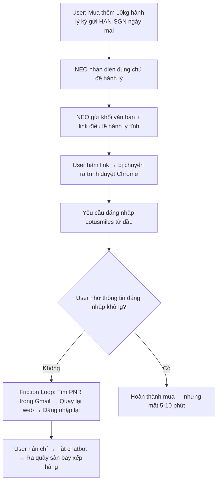
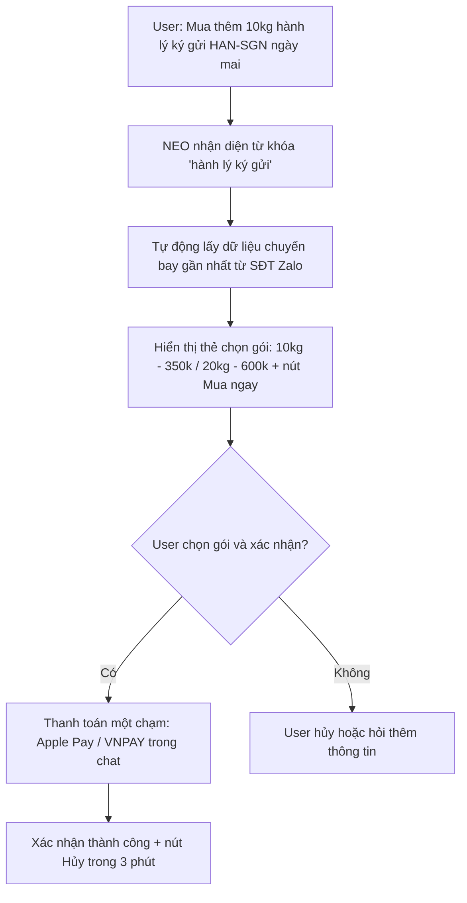

# App Teardown — Vietnam Airlines NEO

## 1. Product và task được thử

**Product:** Vietnam Airlines — NEO  
**AI feature:** Chatbot AI hỗ trợ khách hàng (Website & Zalo OA)  
**User cụ thể:** Hành khách cần xử lý giao dịch nhanh khi đang trên đường ra sân bay  
**Task:** Mua thêm hành lý ký gửi và tra cứu trạng thái chuyến bay theo thời gian thực

---

## 2. Product Promise

NEO được kỳ vọng là trợ lý ảo 24/7 giúp hành khách:

> "Hỗ trợ mua vé, đổi hành trình, check-in và giải đáp mọi thủ tục bay lập tức 24/7."

Cam kết cốt lõi là **giải quyết tác vụ tại điểm chạm**, không yêu cầu hành khách chuyển sang kênh khác.

---

## 3. Promise vs Reality

### Câu truy vấn 1 — Mua thêm hành lý ký gửi

**Input thử:**

> "Tôi muốn mua thêm 10kg hành lý ký gửi chặng Hà Nội - Sài Gòn ngày mai."

**Kỳ vọng:**  
Hệ thống tự động liên kết tài khoản, hiển thị bảng giá các gói 10kg/20kg kèm nút [Mua ngay] và thanh toán một chạm (Apple Pay / VNPAY) trực tiếp trong chat.

**Thực tế:**  
Chatbot gửi một khối văn bản dài kèm link dẫn đến trang "Điều lệ hành lý ký gửi". Người dùng bấm vào link bị chuyển hướng ra trình duyệt ngoài và bắt đăng nhập tài khoản Lotusmiles từ đầu.

---

### Câu truy vấn 2 — Tra cứu trạng thái chuyến bay

**Input thử:**

> "Chuyến bay VN213 của tôi chiều nay có bị delay không?"

**Kỳ vọng:**  
Trợ lý ảo tự quét lịch trình từ số điện thoại/email đăng ký Zalo của tôi, nhận diện chuyến bay VN213 và báo ngay trạng thái thời gian thực: "Dự kiến khởi hành 14:30 (Đúng giờ)".

**Thực tế:**  
Bot báo lỗi hệ thống và yêu cầu người dùng phải gõ chính xác: Mã đặt chỗ (PNR) gồm 6 ký tự, họ tên đầy đủ không dấu. Người dùng đang đi taxi gấp ra sân bay không thể lục lại email tìm PNR.

---

## 4. Evidence Table

| ID | Input | Observation | Path | Screenshot |
| -- | ----- | ----------- | ---- | ---------- |
| E1 | `Tôi muốn mua thêm 10kg hành lý ký gửi chặng HAN-SGN ngày mai.` | Chatbot trả link điều lệ hành lý, chuyển hướng ra trình duyệt ngoài, bắt đăng nhập Lotusmiles từ đầu. | Failure / transaction broken | [Ảnh E1](./evidence/evidence-01.png) |
| E2 | `Chuyến bay gần nhất của tôi là chuyến nào?` | Bot không tự nhận diện từ tài khoản Zalo, yêu cầu nhập PNR hoặc thông tin đặt chỗ thủ công. | Failure / missing identity resolution | [Ảnh E2](./evidence/evidence-02.png) |

---

## 5. Four Paths Analysis

| Path | Product hiện xử lý thế nào? | Đánh giá |
| ---- | --------------------------- | -------- |
| Happy path | Không quan sát được trong 2 query thử — cả hai đều yêu cầu giao dịch thực, không phải FAQ. | Chưa kiểm chứng |
| Low-confidence path | Khi user hỏi thiếu dữ liệu (VN213 delay), NEO không tự resolve từ dữ liệu Zalo mà báo lỗi và yêu cầu nhập thủ công. | Gãy |
| Failure path | Khi user cần giao dịch (mua hành lý), NEO redirect ra trình duyệt ngoài và bắt đăng nhập lại. | Gãy hoàn toàn |
| Correction path | Không quan sát được trong 2 query thử. | Chưa kiểm chứng |

---

## 6. Finding chính — Chatbot hoạt động như danh bạ link tĩnh, không phải trợ lý giao dịch

Khi hành khách có nhu cầu giao dịch tức thì như:

> "Tôi muốn mua thêm 10kg hành lý ký gửi chặng Hà Nội - Sài Gòn ngày mai."

NEO không xử lý giao dịch tại điểm chạm mà đẩy người dùng ra trình duyệt ngoài bằng một link tĩnh.

Khi hành khách cần tra cứu thời gian thực:

> "Chuyến bay VN213 của tôi chiều nay có bị delay không?"

NEO không tích hợp dữ liệu nhận dạng từ Zalo mà yêu cầu nhập thủ công PNR và họ tên — gây friction nghiêm trọng trong tình huống khẩn cấp.

**Impact:**  
Thay vì giúp hành khách giao dịch nhanh, chatbot hoạt động như một danh bạ link tĩnh, đẩy người dùng ra ngoài trình duyệt khiến luồng thanh toán và tra cứu bị đứt gãy nghiêm trọng. User nản chí, tắt chatbot, chấp nhận ra quầy sân bay xếp hàng 20 phút và mua giá đắt gấp đôi.

**Layer:**

* `Promise vs Capability gap` — Bot hứa xử lý giao dịch nhưng chỉ cung cấp thông tin tĩnh
* `Identity resolution` — Không tận dụng dữ liệu định danh đã có từ Zalo/Lotusmiles
* `Transaction closure` — Không có khả năng hoàn thành giao dịch trong luồng chat
* `UX friction` — Redirect ra trình duyệt phá vỡ luồng hoàn toàn

---

## 7. Product Decision

**Chuyển dịch từ chatbot trả lời FAQ tĩnh thành "Actionable Bot":**

Tích hợp sâu API Booking Engine và các cổng thanh toán nhanh trực tiếp vào khung chat để triệt tiêu 100% việc điều hướng link ra trình duyệt ngoài.

Cụ thể:

1. **API Integration:** Đồng bộ trực tiếp với hệ thống đặt vé (Sabre/Amadeus) để tự động tra cứu chuyến bay từ số điện thoại/email Zalo đã đăng ký — không yêu cầu nhập PNR thủ công.
2. **In-Chat Widget:** Thiết kế thẻ chọn gói hành lý (10kg - 350k / 20kg - 600k) kèm nút [Mua ngay] hiển thị trực tiếp trong chat, không redirect ra ngoài.
3. **One-Click Payment:** Tích hợp SDK thanh toán nhanh (Apple Pay / VNPAY) trực tiếp trong chat. Bổ sung nút [Hủy/Undo] trong vòng 3 phút phòng khi ấn nhầm.

---

## 8. Sketch As-is

**Điểm gãy trí mạng (Primary Friction Loop):**  
Link redirect ra trình duyệt + bắt đăng nhập lại = luồng thanh toán đứt gãy hoàn toàn. User đang gấp không thể hoàn thành tác vụ trong chat.

---

## 9. Sketch To-be

---

## 10. SPEC Impact

Finding này làm thay đổi SPEC bằng cách thêm một **transaction-capable chatbot layer**:

Khi user có nhu cầu giao dịch (mua hành lý, đổi chỗ ngồi, check-in), chatbot không được redirect ra trình duyệt ngoài. Chatbot phải:

1. Nhận diện intent giao dịch từ câu hỏi của user.
2. Tự động truy vấn dữ liệu tài khoản/chuyến bay từ SĐT Zalo hoặc email đã đăng ký.
3. Hiển thị widget lựa chọn có giá rõ ràng và nút hành động ngay trong luồng chat.
4. Hoàn thành thanh toán qua SDK tích hợp — không rời khỏi chat.
5. Fallback sang human handoff khi không thể xác định thông tin tài khoản.

Human handoff vẫn được giữ lại với vai trò `rescuer` khi bot không thể hoàn thành giao dịch.

